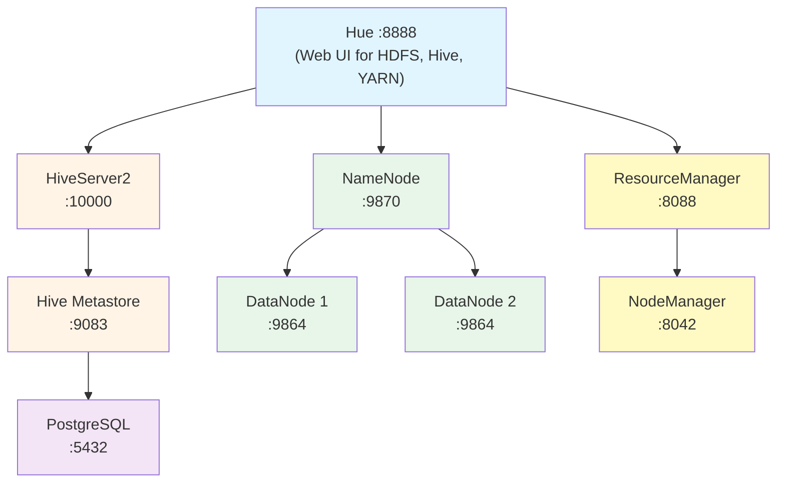

# Hadoop Big Data Stack with Docker Compose

Complete containerized big data stack featuring:
- **Hadoop HDFS** (NameNode + 2 DataNodes)
- **YARN** (ResourceManager + NodeManager)
- **Apache Hive** (Metastore + HiveServer2)
- **Hue** (Web UI for HDFS, Hive, and YARN)
- **PostgreSQL** (Hive Metastore backend)

## Introduction

This stack provides a complete big data ecosystem for storing, processing, and analyzing large datasets:

### **Hadoop HDFS** - Distributed File System
HDFS (Hadoop Distributed File System) is like a giant hard drive spread across multiple machines. It breaks large files into chunks and stores multiple copies across different servers for reliability. Think of it as cloud storage, but designed for massive datasets (terabytes to petabytes).

- **Official site**: https://hadoop.apache.org/
- **Documentation**: https://hadoop.apache.org/docs/stable/

### **YARN** - Cluster Resource Manager
YARN (Yet Another Resource Negotiator) is the traffic controller for your Hadoop cluster. It decides which applications get to run where and when, managing CPU and memory across all machines. It's like an operating system scheduler, but for an entire cluster.

- **Documentation**: https://hadoop.apache.org/docs/stable/hadoop-yarn/hadoop-yarn-site/YARN.html

### **Apache Hive** - Data Warehouse System
Hive lets you query massive datasets using SQL instead of writing complex MapReduce code. It translates your SQL queries into jobs that run across the cluster. Think of it as a traditional database, but designed to handle datasets too large for regular databases.

- **Official site**: https://hive.apache.org/
- **Quick start**: https://hive.apache.org/development/quickstart/

### **Hue** - Web Interface
Hue is the graphical dashboard that makes everything accessible through your browser. Instead of typing commands, you can browse files, write SQL queries, and monitor jobs with a friendly interface. It's like having a GUI desktop for your entire big data stack.

- **Official site**: https://gethue.com/
- **Documentation**: https://docs.gethue.com/

### **PostgreSQL** - Metadata Storage
PostgreSQL stores Hive's "metadata" - information about your tables, columns, and where data is stored. It's like the catalog in a library that tells you where to find books, but for your big data tables.

- **Official site**: https://www.postgresql.org/

## Architecture



## Prerequisites

- Docker Desktop or Docker Engine
- Docker Compose v3.8+
- At least 8GB RAM available for Docker
- Ports available: 8020, 8088, 8888, 9083, 9864, 9865, 9870, 10000, 10002

## Quick Start

1. **Start the stack:**
   ```bash
   docker compose up -d
   ```

2. **Check services are healthy:**
   ```bash
   docker compose ps
   ```

3. **Access the UIs:**
   - **Hue**: http://localhost:8888 (SQL editor, HDFS browser, YARN monitor)
   - **NameNode**: http://localhost:9870
   - **ResourceManager**: http://localhost:8088
   - **HiveServer2**: http://localhost:10002

4. **Run the test suite (optional):**
   ```bash
   ./test-stack.sh
   ```
   This will verify all components are working correctly by:
   - Checking all services are running
   - Testing HDFS operations (create, read, write)
   - Verifying YARN ResourceManager and NodeManager
   - Testing Hive database and table operations
   - Validating Hue and WebHDFS connectivity

## Service Details

### HDFS Services
- **NameNode** (`namenode:8020`, Web: `9870`)
  - Manages HDFS namespace and metadata
  - Data persisted in volume `namenode_data`

- **DataNode 1** (`datanode1`, Web: `9864`)
- **DataNode 2** (`datanode2`, Web: `9865`)
  - Store actual data blocks
  - Replication factor: 2

### YARN Services
- **ResourceManager** (`resourcemanager:8032`, Web: `8088`)
  - Manages cluster resources
  - Schedules applications

- **NodeManager** (`nodemanager`, Web: `8042`)
  - Manages resources on a single node
  - Executes containers
  - Memory: 4GB, CPU: 2 cores

### Hive Services
- **PostgreSQL** (`postgres:5432`)
  - Stores Hive metadata
  - Database: `metastore_db`
  - User: `hive` / Password: `hivepw`

- **Metastore** (`metastore:9083`)
  - Manages Hive table metadata
  - Connected to PostgreSQL backend

- **HiveServer2** (`hiveserver2:10000`, Web: `10002`)
  - JDBC/ODBC interface to Hive
  - Executes HiveQL queries

### Hue
- **Hue** (`hue:8888`)
  - Web-based interface for:
    - SQL queries (Hive)
    - HDFS file browser (WebHDFS)
    - YARN job monitoring
  - Default login: create on first access

## Usage Examples

### 1. Using Hive via Beeline

Connect to HiveServer2:
```bash
docker exec -it hive-hs2 beeline -u 'jdbc:hive2://localhost:10000/'
```

Create a database and table:
```sql
CREATE DATABASE demo;
USE demo;
CREATE TABLE users (
  id INT,
  name STRING,
  email STRING
) STORED AS PARQUET;

INSERT INTO users VALUES
  (1, 'Alice', 'alice@example.com'),
  (2, 'Bob', 'bob@example.com');

SELECT * FROM users;
```

### 2. Using HDFS via CLI

List HDFS root:
```bash
docker exec -it namenode hdfs dfs -ls /
```

Create a directory and upload a file:
```bash
# Create directory
docker exec -it namenode hdfs dfs -mkdir -p /user/data

# Upload file (create a test file first)
echo "Hello HDFS" > test.txt
docker cp test.txt namenode:/tmp/test.txt
docker exec -it namenode hdfs dfs -put /tmp/test.txt /user/data/

# List and read
docker exec -it namenode hdfs dfs -ls /user/data
docker exec -it namenode hdfs dfs -cat /user/data/test.txt
```

### 3. Using Hue Web UI

1. Open http://localhost:8888
2. Create a user account on first access
3. **SQL Editor**: Click "Editor" → "Hive" to run HiveQL
4. **File Browser**: Click "Files" to browse HDFS via WebHDFS
5. **YARN Jobs**: Click "Jobs" to monitor MapReduce/Spark jobs

### 4. Running a MapReduce Job

Example word count:
```bash
# Create input file
docker exec -it namenode bash -c "echo 'hello world hello hadoop' | hdfs dfs -put - /user/input.txt"

# Run word count
docker exec -it resourcemanager hadoop jar \
  /opt/hadoop/share/hadoop/mapreduce/hadoop-mapreduce-examples-*.jar \
  wordcount /user/input.txt /user/output

# View results
docker exec -it namenode hdfs dfs -cat /user/output/part-r-00000
```

## Configuration Files

### Hadoop Configs
- [`hadoop_config/core-site.xml`](hadoop_config/core-site.xml) - Core Hadoop settings
- [`hadoop_config/hdfs-site.xml`](hadoop_config/hdfs-site.xml) - HDFS configuration
- [`hadoop_config/yarn-site.xml`](hadoop_config/yarn-site.xml) - YARN resource management
- [`hadoop_config/mapred-site.xml`](hadoop_config/mapred-site.xml) - MapReduce settings

### Hue Config
- [`hue/hue.ini`](hue/hue.ini) - Hue web interface configuration

### Scripts
- [`scripts/start-hdfs.sh`](scripts/start-hdfs.sh) - NameNode initialization
- [`scripts/init-datanode.sh`](scripts/init-datanode.sh) - DataNode startup
- [`scripts/start-yarn-rm.sh`](scripts/start-yarn-rm.sh) - ResourceManager startup
- [`scripts/start-yarn-nm.sh`](scripts/start-yarn-nm.sh) - NodeManager startup

## Networking

Custom bridge network `hadoop` (172.22.0.0/16):
- NameNode: 172.22.0.2
- DataNode 1: 172.22.0.3
- DataNode 2: 172.22.0.4
- ResourceManager: 172.22.0.5
- NodeManager: 172.22.0.6
- PostgreSQL: 172.22.0.10
- Metastore: 172.22.0.11
- HiveServer2: 172.22.0.12
- Hue: 172.22.0.20

## Volumes

Persistent data stored in Docker volumes:
- `namenode_data` - HDFS namespace and metadata
- `datanode1_data` - HDFS block data (node 1)
- `datanode2_data` - HDFS block data (node 2)
- `hive_warehouse` - Hive table data
- `hive_db` - PostgreSQL Hive metastore

## Troubleshooting

### Hive connection issues
```bash
# Check metastore logs
docker logs hive-metastore

# Check HiveServer2 logs
docker logs hive-hs2

# Verify PostgreSQL connectivity
docker exec -it hive-postgres psql -U hive -d metastore_db -c '\dt'
```

### HDFS issues
```bash
# Check NameNode status
docker exec -it namenode hdfs dfsadmin -report

# Verify DataNodes are connected
curl http://localhost:9870/jmx | jq '.beans[] | select(.name=="Hadoop:service=NameNode,name=FSNamesystemState") | .NumLiveDataNodes'
```

### YARN issues
```bash
# Check ResourceManager logs
docker logs resourcemanager

# Check NodeManager status
docker exec -it resourcemanager yarn node -list
```

### Hue can't browse HDFS
- Ensure WebHDFS is enabled in `hdfs-site.xml`
- Check NameNode WebHDFS endpoint: `curl http://namenode:9870/webhdfs/v1/?op=LISTSTATUS`

### PostgreSQL JDBC driver missing
The PostgreSQL JDBC driver should be in `jars/postgresql-42.7.5.jar`. If missing:
```bash
curl -L -o jars/postgresql-42.7.5.jar \
  https://jdbc.postgresql.org/download/postgresql-42.7.5.jar
```

## Stopping and Cleanup

Stop services:
```bash
docker compose down
```

Remove volumes (⚠️ deletes all data):
```bash
docker compose down -v
```

## Performance Tuning

For production or larger datasets, adjust these in [`hadoop_config/yarn-site.xml`](hadoop_config/yarn-site.xml):
- `yarn.nodemanager.resource.memory-mb` (default: 4096)
- `yarn.nodemanager.resource.cpu-vcores` (default: 2)
- `yarn.scheduler.maximum-allocation-mb` (default: 4096)

## References

- [Apache Hadoop Documentation](https://hadoop.apache.org/docs/stable/)
- [Apache Hive Documentation](https://hive.apache.org/)
- [Hue Documentation](https://docs.gethue.com/)
- [Docker Compose Documentation](https://docs.docker.com/compose/)

## License

This stack configuration is provided as-is for educational and development purposes.
