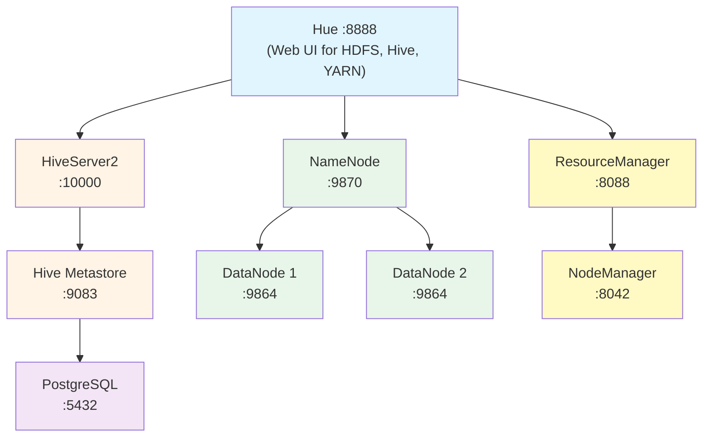

# Hadoop Big Data Stack with Docker Compose

Complete containerized big data stack featuring:
- **Hadoop HDFS** (NameNode + 2 DataNodes)
- **YARN** (ResourceManager + NodeManager)
- **Apache Hive** (Metastore + HiveServer2)
- **Web UI Options**: Apache Zeppelin (recommended for ARM64) or Hue
- **PostgreSQL** (Hive Metastore backend + Source DB)
- **ETL Tools**: Apache Airflow & Apache NiFi (optional)
- **pgAdmin** (Database management UI)

## Introduction

This stack provides a complete big data ecosystem for storing, processing, and analyzing large datasets:

### **Hadoop HDFS** - Distributed File System
HDFS (Hadoop Distributed File System) is like a giant hard drive spread across multiple machines. It breaks large files into chunks and stores multiple copies across different servers for reliability. Think of it as cloud storage, but designed for massive datasets (terabytes to petabytes).

- **Official site**: https://hadoop.apache.org/
- **Documentation**: https://hadoop.apache.org/docs/stable/

### **YARN** - Cluster Resource Manager
YARN (Yet Another Resource Negotiator) is the traffic controller for your Hadoop cluster. It decides which applications get to run where and when, managing CPU and memory across all machines. It's like an operating system scheduler, but for an entire cluster.

- **Documentation**: https://hadoop.apache.org/docs/stable/hadoop-yarn/hadoop-yarn-site/YARN.html

### **Apache Hive** - Data Warehouse System
Hive lets you query massive datasets using SQL instead of writing complex MapReduce code. It translates your SQL queries into jobs that run across the cluster. Think of it as a traditional database, but designed to handle datasets too large for regular databases.

- **Official site**: https://hive.apache.org/
- **Quick start**: https://hive.apache.org/development/quickstart/

### **Hue** - Web Interface 
Hue is an alternative graphical dashboard that provides a browser interface for HDFS, Hive, and YARN. It offers file browsing, SQL editing, and job monitoring capabilities.

- **Official site**: https://gethue.com/
- **Documentation**: https://docs.gethue.com/
- **Note**: May have stability issues on ARM64/Apple Silicon (Rosetta emulation)

### **Apache Zeppelin** - Notebook-based Web Interface (Alternative)
Zeppelin is a web-based notebook that lets you interactively query and visualize data. Write SQL queries, create charts, and document your analysis all in one place. It's like Jupyter Notebook, but optimized for big data tools like Hive and Spark.

- **Official site**: https://zeppelin.apache.org/
- **Documentation**: https://zeppelin.apache.org/docs/latest/
- **Note**: Recommended for ARM64/Apple Silicon users

### **PostgreSQL** - Metadata & Data Storage
PostgreSQL serves multiple roles in this stack:
- **Hive Metastore**: Stores metadata about Hive tables, columns, and partitions
- **Source Database**: Simulates operational databases for ETL workflows
- **Airflow Metadata**: Stores Airflow DAG runs, task states, and connections (when using Airflow)

- **Official site**: https://www.postgresql.org/

### **Apache Airflow** - Workflow Orchestration (Optional)
Airflow is a platform for programmatically authoring, scheduling, and monitoring data pipelines. Write Python code to define ETL workflows (DAGs) that extract from Postgres, transform data, and load into HDFS/Hive.

- **Official site**: https://airflow.apache.org/
- **Documentation**: https://airflow.apache.org/docs/
- **Use case**: Code-first approach to building ETL pipelines with dependencies and retry logic

### **Apache NiFi** - Visual ETL Tool (Optional)
NiFi provides a web-based visual interface for designing data flows. Drag-and-drop processors to route, transform, and deliver data between systems without writing code.

- **Official site**: https://nifi.apache.org/
- **Documentation**: https://nifi.apache.org/docs.html
- **Use case**: Visual, flow-based ETL design; real-time data ingestion and routing

### **pgAdmin** - Database Management UI
pgAdmin is a web-based administration tool for PostgreSQL. Browse databases, run SQL queries, and manage database objects through an intuitive interface.

- **Official site**: https://www.pgadmin.org/
- **Documentation**: https://www.pgadmin.org/docs/

## Architecture



## Prerequisites

- Docker Desktop or Docker Engine
- Docker Compose v3.8+
- At least 8GB RAM available for Docker (12GB recommended with ETL tools)
- Ports available: 5050, 5432, 8020, 8081, 8088, 8443, 8888, 9083, 9864, 9865, 9870, 10000, 10002

## Quick Start

### 1. Start Core Services (HDFS, YARN, Hive)

```bash
docker compose up -d
```

This starts all core Hadoop services without a web UI.

### 2. Choose Your Web UI & Optional Services

#### **Option A: Apache Zeppelin (Recommended for ARM64/Apple Silicon)**

```bash
docker compose --profile zeppelin up -d
```

Access at http://localhost:8080

✅ **Advantages:**
- More stable on ARM64/Apple Silicon
- Java-based (no Python CPU instruction issues)
- Interactive notebook interface
- Better for data analysis and visualization

#### **Option B: Hue (May have issues on ARM64)**

```bash
docker compose --profile hue up -d
```

Access at http://localhost:8888

⚠️ **Note:** May crash with "Illegal instruction" errors on ARM64 due to Polars library incompatibility

#### **Option C: Add ETL Tools**

Start with Airflow (code-based ETL):
```bash
docker compose --profile airflow up -d
```

Start with NiFi (visual ETL):
```bash
docker compose --profile nifi up -d
```

Start both ETL tools:
```bash
docker compose --profile airflow --profile nifi up -d
```

#### **Option D: Everything**

```bash
docker compose --profile all up -d
```

All services including Zeppelin, Hue, Airflow, and NiFi

### 3. Verify Services

```bash
docker compose ps
```

### 4. Access Web Interfaces

**Core Services:**
- **NameNode**: http://localhost:9870
- **ResourceManager**: http://localhost:8088
- **HiveServer2**: http://localhost:10002

**Optional UIs (based on profile):**
- **Zeppelin**: http://localhost:8080
- **Hue**: http://localhost:8888
- **pgAdmin**: http://localhost:5050 (login: `admin@admin.com` / `admin`)
- **Airflow**: http://localhost:8081 (login: `admin` / `admin`)
- **NiFi**: https://localhost:8443/nifi (login: `admin` / `adminadminadmin`)

### 5. Run Test Suite (Optional)

```bash
bash test-stack.sh
```

This validates:
- All services are running
- HDFS operations (create, read, write)
- YARN cluster status
- Hive database and table operations
- Web UI accessibility
- WebHDFS API

## Service Details

### HDFS Services
- **NameNode** (`namenode:8020`, Web: `9870`)
  - Manages HDFS namespace and metadata
  - Data persisted in volume `namenode_data`

- **DataNode 1** (`datanode1`, Web: `9864`)
- **DataNode 2** (`datanode2`, Web: `9865`)
  - Store actual data blocks
  - Replication factor: 2

### YARN Services
- **ResourceManager** (`resourcemanager:8032`, Web: `8088`)
  - Manages cluster resources
  - Schedules applications

- **NodeManager** (`nodemanager`, Web: `8042`)
  - Manages resources on a single node
  - Executes containers
  - Memory: 4GB, CPU: 2 cores

### Hive Services
- **PostgreSQL** (`postgres:5432`)
  - Stores Hive metadata
  - Database: `metastore_db`
  - User: `hive` / Password: `hivepw`

- **Metastore** (`metastore:9083`)
  - Manages Hive table metadata
  - Connected to PostgreSQL backend

- **HiveServer2** (`hiveserver2:10000`, Web: `10002`)
  - JDBC/ODBC interface to Hive
  - Executes HiveQL queries

### Data Management & ETL Services

- **PostgreSQL Source** (`postgres-source:5432`)
  - Source database for ETL workflows
  - Database: `sourcedb`
  - User: `sourceuser` / Password: `sourcepw`
  - Pre-configured in pgAdmin

- **pgAdmin** (`pgadmin:80`, host port `5050`)
  - Web-based PostgreSQL management
  - Login: `admin@admin.com` / `admin`
  - Pre-configured connection to source DB

- **PostgreSQL Airflow** (`postgres-airflow:5432`)
  - Airflow metadata database
  - Database: `airflow`
  - User: `airflow` / Password: `airflow`
  - Profile: `airflow` or `all`

- **Apache Airflow** (`airflow:8080`, host port `8081`)
  - Workflow orchestration platform
  - Login: `admin` / `admin`
  - Pre-configured connections:
    - `postgres_source` - Source PostgreSQL
    - `hive_cli` - Hive CLI
    - `hiveserver2` - HiveServer2 JDBC
    - `hdfs` - HDFS native
    - `webhdfs` - WebHDFS REST API
  - CSV files: Mount `./data/csv/` → accessible at `/opt/airflow/csv`
  - Profile: `airflow` or `all`

- **Apache NiFi** (`nifi:8443`)
  - Visual dataflow automation
  - Login: `admin` / `adminadminadmin`
  - CSV files: Mount `./data/csv/` → accessible at `/opt/nifi/csv`
  - Profile: `nifi` or `all`

### Web UIs (Optional - based on profile)

- **Zeppelin** (`zeppelin:8080`)
  - Notebook-based web interface
  - Interactive SQL queries (Hive JDBC)
  - Data visualization
  - Profile: `zeppelin` or `all`

- **Hue** (`hue:8888`)
  - Alternative web-based interface
  - SQL editor, HDFS browser, YARN monitor
  - Default login: create on first access
  - Profile: `hue` or `all`
  - ⚠️ May have issues on ARM64/Apple Silicon

## Usage Examples

### 1. Using Hive via Beeline

Connect to HiveServer2:
```bash
docker exec -it hive-hs2 beeline -u 'jdbc:hive2://localhost:10000/'
```

Create a database and table:
```sql
CREATE DATABASE demo;
USE demo;
CREATE TABLE users (
  id INT,
  name STRING,
  email STRING
) STORED AS PARQUET;

INSERT INTO users VALUES
  (1, 'Alice', 'alice@example.com'),
  (2, 'Bob', 'bob@example.com');

SELECT * FROM users;
```

### 2. Using HDFS via CLI

List HDFS root:
```bash
docker exec -it namenode hdfs dfs -ls /
```

Create a directory and upload a file:
```bash
# Create directory
docker exec -it namenode hdfs dfs -mkdir -p /user/data

# Upload file (create a test file first)
echo "Hello HDFS" > test.txt
docker cp test.txt namenode:/tmp/test.txt
docker exec -it namenode hdfs dfs -put /tmp/test.txt /user/data/

# List and read
docker exec -it namenode hdfs dfs -ls /user/data
docker exec -it namenode hdfs dfs -cat /user/data/test.txt
```

### 3. Using Zeppelin Web UI

1. Open http://localhost:8080
2. Create a new notebook
3. Use JDBC interpreter to query Hive:

```sql
%jdbc

SHOW DATABASES;

CREATE DATABASE demo;
USE demo;

CREATE TABLE users (
  id INT,
  name STRING,
  email STRING
) STORED AS PARQUET;

INSERT INTO users VALUES (1, 'Alice', 'alice@example.com');

SELECT * FROM users;
```

### 4. Using Hue Web UI (if enabled)

1. Open http://localhost:8888
2. Create a user account on first access
3. **SQL Editor**: Click "Editor" → "Hive" to run HiveQL
4. **File Browser**: Click "Files" to browse HDFS via WebHDFS
5. **YARN Jobs**: Click "Jobs" to monitor MapReduce/Spark jobs

### 5. Running a MapReduce Job

Example word count:
```bash
# Create input file
docker exec -it namenode bash -c "echo 'hello world hello hadoop' | hdfs dfs -put - /user/input.txt"

# Run word count
docker exec -it resourcemanager hadoop jar \
  /opt/hadoop/share/hadoop/mapreduce/hadoop-mapreduce-examples-*.jar \
  wordcount /user/input.txt /user/output

# View results
docker exec -it namenode hdfs dfs -cat /user/output/part-r-00000
```

### 6. Using pgAdmin

1. Open http://localhost:5050
2. Login with `admin@admin.com` / `admin`
3. **Source Database** server is pre-configured
4. Click on "Source Database" → Connect
5. Browse databases, run queries, manage tables

### 7. ETL with Apache Airflow

**Prepare CSV files:**
```bash
mkdir -p data/csv
echo "id,name,value" > data/csv/sample.csv
echo "1,Alice,100" >> data/csv/sample.csv
echo "2,Bob,200" >> data/csv/sample.csv
```

**Example DAG** (`/opt/airflow/dags/csv_to_hive.py`):
```python
from airflow import DAG
from airflow.providers.postgres.hooks.postgres import PostgresHook
from airflow.providers.apache.hive.hooks.hive import HiveCliHook
from airflow.operators.python import PythonOperator
from datetime import datetime

def load_csv_to_hive():
    # Read CSV
    with open('/opt/airflow/csv/sample.csv', 'r') as f:
        data = f.read()

    # Create Hive table and load data
    hive = HiveCliHook(hive_cli_conn_id='hive_cli')
    hive.run_cli("""
        CREATE DATABASE IF NOT EXISTS etl;
        USE etl;
        CREATE TABLE IF NOT EXISTS sample (id INT, name STRING, value INT);
    """)

with DAG('csv_to_hive', start_date=datetime(2024, 1, 1), schedule='@daily') as dag:
    load_task = PythonOperator(
        task_id='load_csv',
        python_callable=load_csv_to_hive
    )
```

Access Airflow at http://localhost:8081 to monitor and trigger DAGs.

### 8. ETL with Apache NiFi

1. Open https://localhost:8443/nifi (accept self-signed certificate)
2. Login with `admin` / `adminadminadmin`
3. Drag processors onto canvas:
   - **GetFile** → Read from `/opt/nifi/csv/`
   - **PutHDFS** → Write to HDFS at `hdfs://namenode:8020`
   - **PutSQL** → Write to Postgres at `postgres-source:5432`
4. Configure connections between processors
5. Start the flow

**Common NiFi processor configurations:**
- **HDFS**: Use `hdfs://namenode:8020` as connection URL
- **Postgres**: JDBC URL `jdbc:postgresql://postgres-source:5432/sourcedb`
- **Hive**: JDBC URL `jdbc:hive2://hiveserver2:10000/default`

## Configuration Files

### Hadoop Configs
- [`hadoop_config/core-site.xml`](hadoop_config/core-site.xml) - Core Hadoop settings
- [`hadoop_config/hdfs-site.xml`](hadoop_config/hdfs-site.xml) - HDFS configuration
- [`hadoop_config/yarn-site.xml`](hadoop_config/yarn-site.xml) - YARN resource management
- [`hadoop_config/mapred-site.xml`](hadoop_config/mapred-site.xml) - MapReduce settings

### Hue Config
- [`hue/hue.ini`](hue/hue.ini) - Hue web interface configuration

### Scripts
- [`scripts/start-hdfs.sh`](scripts/start-hdfs.sh) - NameNode initialization
- [`scripts/init-datanode.sh`](scripts/init-datanode.sh) - DataNode startup
- [`scripts/start-yarn-rm.sh`](scripts/start-yarn-rm.sh) - ResourceManager startup
- [`scripts/start-yarn-nm.sh`](scripts/start-yarn-nm.sh) - NodeManager startup

## Networking

Custom bridge network `hadoop` (172.22.0.0/16):
- NameNode: 172.22.0.2
- DataNode 1: 172.22.0.3
- DataNode 2: 172.22.0.4
- ResourceManager: 172.22.0.5
- NodeManager: 172.22.0.6
- PostgreSQL (Hive Metastore): 172.22.0.10
- Metastore: 172.22.0.11
- HiveServer2: 172.22.0.12
- Zeppelin: 172.22.0.20 (profile: `zeppelin` or `all`)
- Hue: 172.22.0.21 (profile: `hue` or `all`)
- PostgreSQL Source: 172.22.0.30
- pgAdmin: 172.22.0.31
- PostgreSQL Airflow: 172.22.0.32 (profile: `airflow` or `all`)
- Airflow: 172.22.0.40 (profile: `airflow` or `all`)
- NiFi: 172.22.0.41 (profile: `nifi` or `all`)

## Volumes

Persistent data stored in Docker volumes:

**Core Hadoop:**
- `namenode_data` - HDFS namespace and metadata
- `datanode1_data` - HDFS block data (node 1)
- `datanode2_data` - HDFS block data (node 2)
- `hive_warehouse` - Hive table data
- `hive_db` - PostgreSQL Hive metastore

**Data & ETL:**
- `source_db` - PostgreSQL source database
- `pgadmin_data` - pgAdmin configuration
- `airflow_db` - Airflow metadata database
- `airflow_logs` - Airflow task logs
- `airflow_dags` - Airflow DAG files
- `airflow_plugins` - Airflow custom plugins
- `airflow_data` - Airflow working data
- `nifi_conf` - NiFi configuration
- `nifi_logs` - NiFi logs
- `nifi_flowfile_repository` - NiFi FlowFile repo
- `nifi_content_repository` - NiFi content repo
- `nifi_provenance_repository` - NiFi provenance repo
- `nifi_state` - NiFi state data

**Local Mounts:**
- `./data/csv/` → Accessible in Airflow at `/opt/airflow/csv` and NiFi at `/opt/nifi/csv`
- `./data/sql/` → Auto-executed SQL scripts on Postgres source DB first start
- `./data/pgadmin/servers.json` → pgAdmin server pre-configuration

## Platform-Specific Notes

### Apple Silicon (M1/M2/M3/M4)

All services use `platform: linux/amd64` for x86 emulation via Rosetta 2.

**Recommended:**
- Use **Zeppelin** instead of Hue (more stable under emulation)
- Enable Rosetta emulation in Docker Desktop settings
- Allocate at least 8GB RAM to Docker Desktop

**Starting services:**
```bash
# Start with Zeppelin (recommended)
docker compose --profile zeppelin up -d

# Or try Hue (may crash)
docker compose --profile hue up -d
```

### Intel/AMD64

Both Zeppelin and Hue should work without issues. Choose based on preference.

## Troubleshooting

### Hue crashes with "Illegal instruction" (ARM64)
**Cause:** Polars library incompatibility with ARM64 under Rosetta

**Solution:** Use Zeppelin instead:
```bash
docker compose stop hue
docker compose --profile zeppelin up -d
```

### YARN ResourceManager fails to start
**Error:** "Queue configuration missing child queue names for root"

**Solution:** Ensure `capacity-scheduler.xml` exists in `hadoop_config/`:
```bash
docker compose restart resourcemanager
```

### Hive connection issues
```bash
# Check metastore logs
docker logs hive-metastore

# Check HiveServer2 logs
docker logs hive-hs2

# Verify PostgreSQL connectivity
docker exec -it hive-postgres psql -U hive -d metastore_db -c '\dt'
```

### HDFS issues
```bash
# Check NameNode status
docker exec -it namenode hdfs dfsadmin -report

# Verify DataNodes are connected
curl http://localhost:9870/jmx | jq '.beans[] | select(.name=="Hadoop:service=NameNode,name=FSNamesystemState") | .NumLiveDataNodes'
```

### YARN issues
```bash
# Check ResourceManager logs
docker logs resourcemanager

# Check NodeManager status
docker exec -it resourcemanager yarn node -list
```

### Hue can't browse HDFS
- Ensure WebHDFS is enabled in `hdfs-site.xml`
- Check NameNode WebHDFS endpoint: `curl http://namenode:9870/webhdfs/v1/?op=LISTSTATUS`

### PostgreSQL JDBC driver missing
The PostgreSQL JDBC driver should be in `jars/postgresql-42.7.5.jar`. If missing:
```bash
curl -L -o jars/postgresql-42.7.5.jar \
  https://jdbc.postgresql.org/download/postgresql-42.7.5.jar
```

## Stopping and Cleanup

Stop services:
```bash
docker compose down
```

Remove volumes (⚠️ deletes all data):
```bash
docker compose down -v
```

## Performance Tuning

For production or larger datasets, adjust these in [`hadoop_config/yarn-site.xml`](hadoop_config/yarn-site.xml):
- `yarn.nodemanager.resource.memory-mb` (default: 4096)
- `yarn.nodemanager.resource.cpu-vcores` (default: 2)
- `yarn.scheduler.maximum-allocation-mb` (default: 4096)

## Docker Compose Profiles Summary

| Profile | Services Included |
|---------|------------------|
| (default) | HDFS, YARN, Hive, Postgres (metastore + source), pgAdmin |
| `zeppelin` | + Apache Zeppelin |
| `hue` | + Hue |
| `airflow` | + Airflow + Postgres Airflow |
| `nifi` | + Apache NiFi |
| `all` | All services (Zeppelin, Hue, Airflow, NiFi) |

**Examples:**
```bash
# Core + Zeppelin only
docker compose --profile zeppelin up -d

# Core + Airflow only
docker compose --profile airflow up -d

# Core + NiFi only
docker compose --profile nifi up -d

# Core + both ETL tools
docker compose --profile airflow --profile nifi up -d

# Everything
docker compose --profile all up -d
```

## References

- [Apache Hadoop Documentation](https://hadoop.apache.org/docs/stable/)
- [Apache Hive Documentation](https://hive.apache.org/)
- [Apache Airflow Documentation](https://airflow.apache.org/docs/)
- [Apache NiFi Documentation](https://nifi.apache.org/docs.html)
- [Apache Zeppelin Documentation](https://zeppelin.apache.org/docs/latest/)
- [Hue Documentation](https://docs.gethue.com/)
- [pgAdmin Documentation](https://www.pgadmin.org/docs/)
- [Docker Compose Documentation](https://docs.docker.com/compose/)

## Notes about NIFI

HDFS components are not avaible by default in Nifi anymore as mentionned here https://stackoverflow.com/questions/79161468/missing-puthdfs-processor-in-apache-nifi-2-0-0

You can find more details on what components have been removed in NiFi 2 here: https://cwiki.apache.org/confluence/display/NIFI/Deprecated+Components+and+Features

Also for reference: https://cwiki.apache.org/confluence/display/NIFI/Migration+Guidance

For HDFS components specifically, there are not packaged in the convenience binary file (ie. nifi-2.0.0-bin.zip) but the components are still built and made available through Maven repositories. You can download the appropriate NARs as needed:

https://mvnrepository.com/artifact/org.apache.nifi/nifi-hadoop-nar
https://mvnrepository.com/artifact/org.apache.nifi/nifi-hadoop-libraries-nar

## License

This stack configuration is provided as-is for educational and development purposes.
