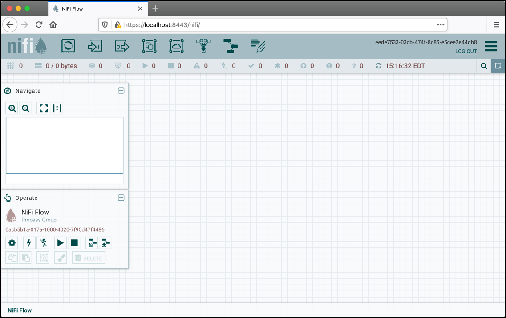
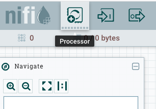
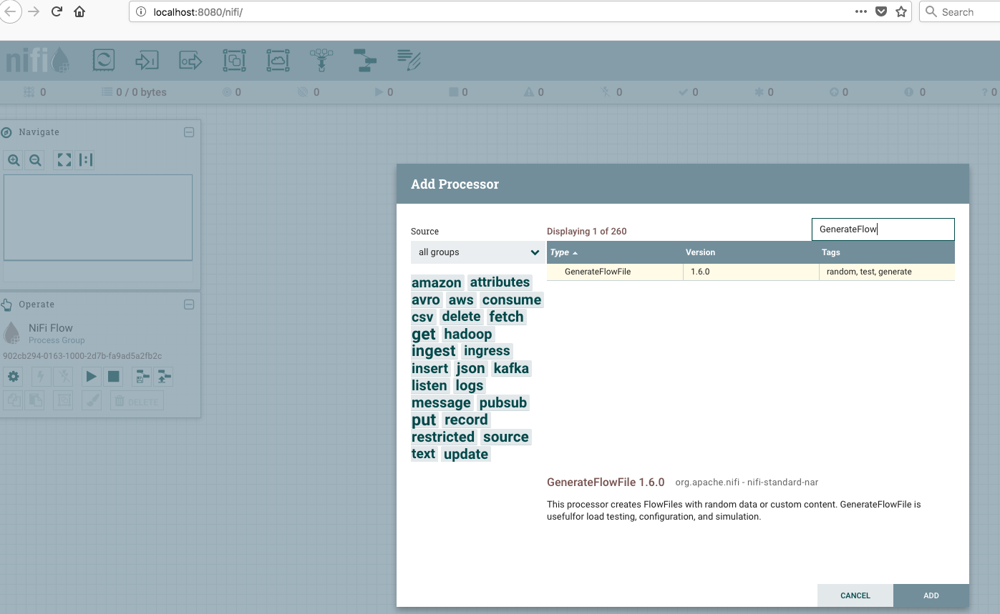
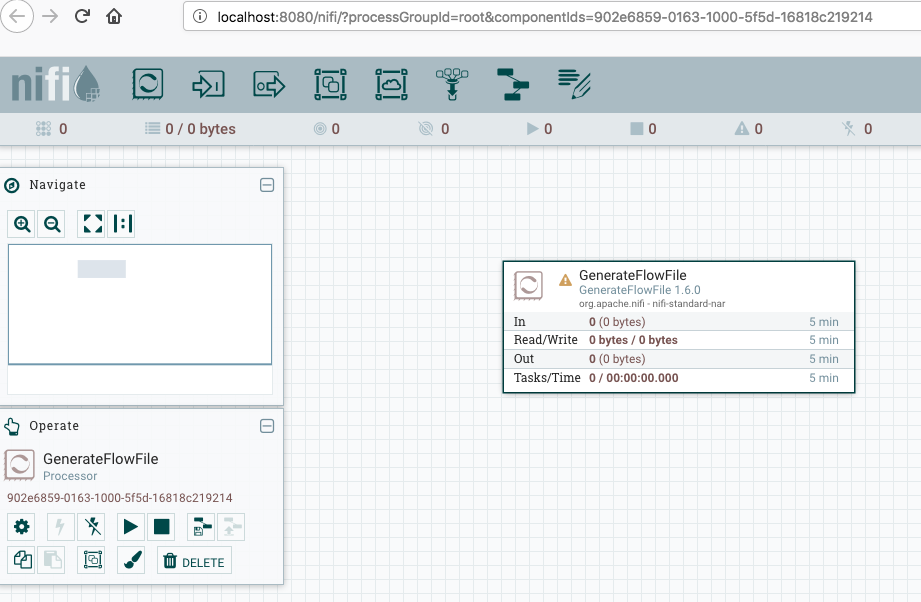
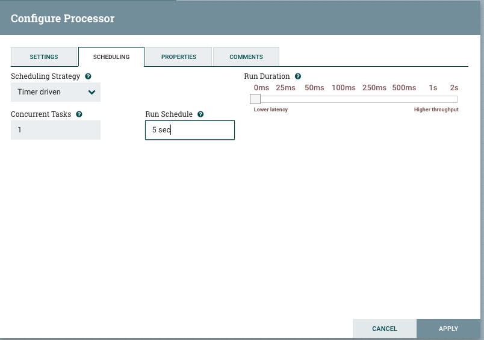
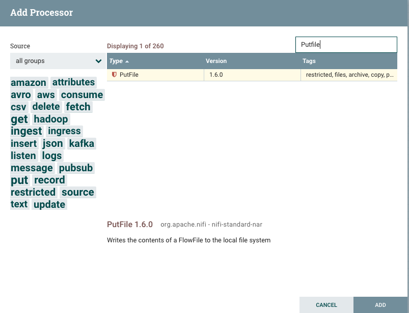
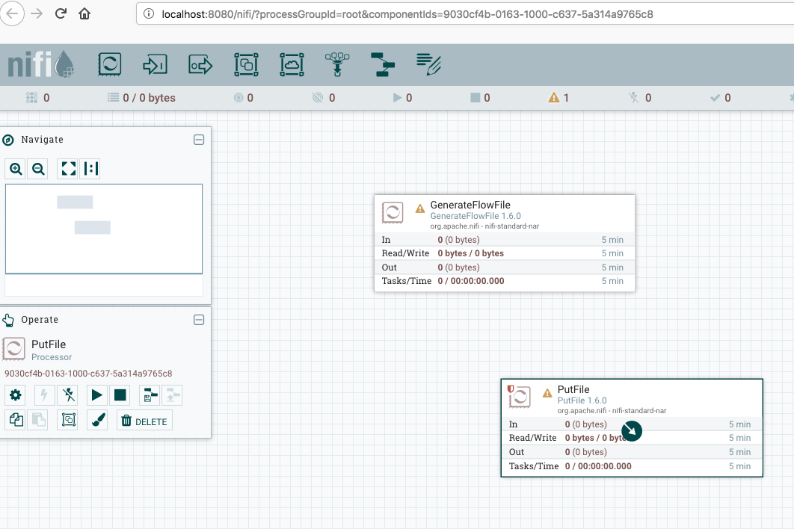
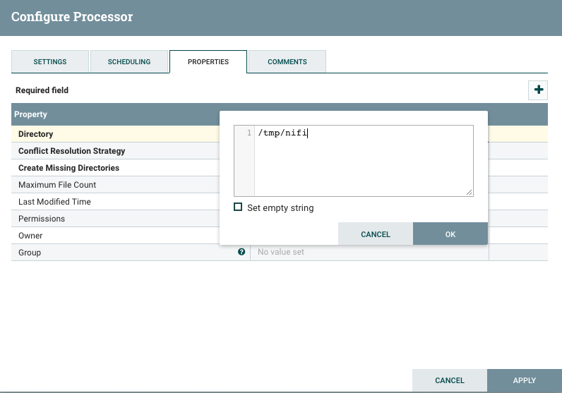
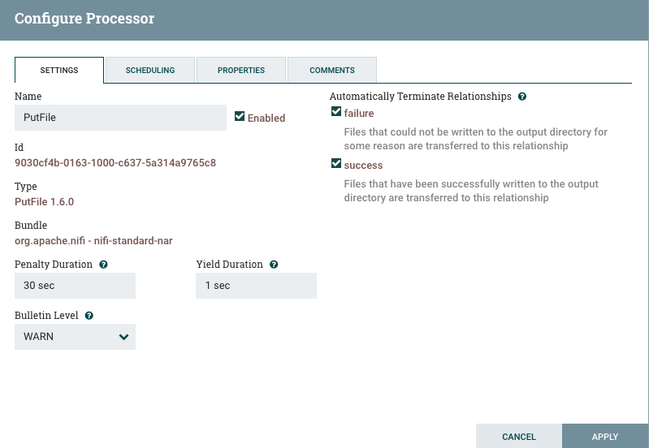

# TP1 - Apache NiFi Introduction

## Objectives

- Understand what Apache NiFi is and its key features
- Access the NiFi web interface
- Create your first data flow: Generate and store files
- Learn basic NiFi concepts: processors, connections, and flow files

**Duration:** 30-45 minutes
**Difficulty:** Beginner

## What is Apache NiFi?

Apache NiFi is an open-source data integration tool that automates the flow of data between systems. It provides:

- **Visual Interface**: Design data flows through drag-and-drop
- **Data Provenance**: Track every piece of data from source to destination
- **Flow-based Programming**: Connect processors to build complex pipelines
- **Real-time Processing**: Process data as it arrives
- **300+ Processors**: Built-in components for common data operations

### Key Concepts

- **Processor**: A component that performs a specific task (generate, transform, route, store data)
- **FlowFile**: A unit of data moving through the system (content + attributes)
- **Connection**: Links between processors that queue FlowFiles
- **Process Group**: Container to organize related processors
- **Controller Services**: Shared services used by multiple processors

## Prerequisites

1. Docker and docker-compose installed
2. Hadoop stack with NiFi profile running
3. Web browser

## Step 1 - Start NiFi

Start the Docker stack with the NiFi profile:

```bash
# Navigate to the project directory
cd /path/to/hadoop-stack-compose

# Start NiFi service
docker-compose --profile nifi up -d

# Check NiFi is running
docker-compose ps nifi
```

Wait for NiFi to fully start (this can take 1-2 minutes). Check the logs:

```bash
docker-compose logs -f nifi
```

Look for a message like: `NiFi has started. The UI is available at the following URLs`

## Step 2 - Access the NiFi UI

1. Open your web browser
2. Navigate to: `https://localhost:8443/nifi`
3. Accept the security warning (NiFi uses a self-signed certificate)
4. Login with credentials:
   - **Username**: `admin`
   - **Password**: `adminadminadmin`

You should see the NiFi canvas - a blank workspace where you'll build data flows.



### Understanding the NiFi Interface

The NiFi UI consists of several key areas:

- **Canvas**: The main workspace for building flows (center)
- **Component Toolbar**: Top bar with processor and component icons
- **Operate Panel**: Left panel for controlling processors and flows
- **Navigation**: Bottom-left for zooming and panning
- **Global Menu**: Top-right hamburger menu for settings and monitoring

## Step 3 - Add and Configure Processor 1 (GenerateFlowFile)

We'll create a simple flow that generates random data files and stores them to disk.

### Add GenerateFlowFile Processor

This processor creates FlowFiles with random or custom content.

1. **Drag a Processor onto the canvas**:
   - Click the **Processor** icon in the top toolbar (looks like a gear)
   - Drag it onto the canvas

2. **Search for GenerateFlowFile**:
   - In the "Add Processor" dialog, type `GenerateFlowFile`
   - Select **GenerateFlowFile** from the list
   - Click **Add**

3. **Configure the processor**:
   - **Right-click** the GenerateFlowFile processor
   - Select **Configure**



### Configure Settings Tab



- **Name**: `Generate Files` (optional but recommended)
- Leave other settings as default for now

### Configure Scheduling Tab



**Adjust the Run Schedule:**
- Click on the **Scheduling** tab
- Change **Run Schedule** from `0 sec` to `5 sec`
- This controls how frequently the processor runs (every 5 seconds)
- ⚠️ **Important**: Never leave Run Schedule at `0 sec` in production - this will consume all CPU resources!



### Configure Properties Tab


**Set the File Size:**
- Click on the **Properties** tab
- Find the **File Size** property
- Change it to `2KB` (this generates 2 kilobyte files with random data)
- Leave other properties as default:
  - **Batch Size**: `1` (one FlowFile per run)
  - **Data Format**: `Binary` (random bytes)
  - **Unique FlowFiles**: `false`

Click **Apply** to save all configuration changes.

## Step 4 - Add and Configure Processor 2 (PutFile)

### Add PutFile Processor

This processor writes FlowFiles to the local filesystem.

1. **Add another processor** to the canvas:
   - Click the **Processor** icon again
   - Search for `PutFile`
   - Select **PutFile** and click **Add**



2. **Configure PutFile**:
   - Right-click the PutFile processor
   - Select **Configure**

### Configure Settings Tab - Auto-terminate Relationships



This is a critical step!

- Click on the **Settings** tab
- In the **Automatically Terminate Relationships** section, check:
  - ✅ **success** - FlowFiles successfully written
  - ✅ **failure** - FlowFiles that failed to write

**Why is this important?**
- Every relationship MUST either connect to another processor OR be auto-terminated
- Without auto-termination, FlowFiles will queue up indefinitely and cause errors

### Configure Properties Tab



- Click on the **Properties** tab
- **Directory**: Set to `/tmp/nifi-output`
  - This is where files will be saved inside the NiFi container
  - The directory will be created automatically if it doesn't exist
- Leave other properties as default:
  - **Conflict Resolution Strategy**: `fail` (don't overwrite existing files)
  - **Create Missing Directories**: `true`

Click **Apply** to save the configuration.


## Step 5 - Connect the Processors

Now we'll create a data flow connection from GenerateFlowFile to PutFile.

### Create the Connection

1. **Hover over the GenerateFlowFile processor**
2. An **arrow icon** (connector) appears in the center of the processor
3. **Click and drag** the arrow to the PutFile processor
4. A "Create Connection" dialog appears


### Configure Connection Settings

In the connection dialog:
- **For Relationships**, ensure **success** is checked
  - This means successful FlowFiles from GenerateFlowFile will be sent to PutFile
- Leave **For Queuing** settings as default
- Click **Add**

You should now see an arrow connecting the two processors with a queue label showing "0" (no FlowFiles yet).



### Understanding Relationships

Processors route FlowFiles based on **relationships**:
- **success**: Processing succeeded
- **failure**: Processing failed
- **original**: Used when splitting or duplicating data

Each relationship must be either:
- Connected to another processor, OR
- Auto-terminated (discarded after processing)

## Step 6 - Start the Processors

Let's run the flow and see it in action!

### Start the Flow

1. **Select both processors**:
   - Click and drag to create a selection box around both processors
   - Or: Hold Shift and click each processor

2. **Start the processors**:
   - Right-click on one of the selected processors
   - Click **Start**
   - Or use the **Play** button (▶) in the Operate panel on the left

### Observe the Flow

Watch what happens:
- Every 5 seconds, GenerateFlowFile creates a new 2KB FlowFile with random data
- The FlowFile travels through the connection to PutFile (you'll see the queue count briefly increase)
- PutFile writes the FlowFile to `/tmp/nifi-output/` and then terminates it

### Check the Statistics

On each processor, you'll see numbers updating:
- **In**: Number of FlowFiles received
- **Out**: Number of FlowFiles sent
- **Read/Written**: Amount of data processed
- **Tasks/Time**: Execution statistics


The flow is now actively generating and storing files!

## Step 7 - View the Generated Files

Let's verify that files are actually being created.

### View Files Inside the NiFi Container

```bash
# Access the NiFi container
docker exec -it nifi bash

# List the generated files
ls -lh /tmp/nifi-output/

# View the first few bytes of a file (random data)
head -c 100 /tmp/nifi-output/* | od -c

# Count the files
ls /tmp/nifi-output/ | wc -l

# Exit the container
exit
```

You should see multiple files, each approximately 2KB in size, with random filenames generated by NiFi.

### Understanding Data Provenance

NiFi tracks every FlowFile from creation to deletion:

1. **Right-click** the connection between processors
2. Select **List queue**
3. If files are queuing (stop PutFile first), you can view them:
   - Click the **View** icon (i) on a FlowFile
   - See content, attributes, and lineage

This is incredibly useful for debugging!

## Step 8 - Stop the Processors

When you're done observing:

1. **Select both processors**:
   - Click and drag to select both

2. **Stop the processors**:
   - Right-click on one
   - Click **Stop**

The processors will finish processing any queued FlowFiles and then stop.

## Bonus: Alternative Flow with LogAttribute

Want to see the data in logs instead of files? Try this alternative flow!

### Create a Logging Flow

1. **Delete** or **Stop** the PutFile processor
2. **Add a new processor**: `LogAttribute`
3. **Configure LogAttribute**:
   - **Settings Tab**: Auto-terminate **success**
   - **Properties Tab**:
     - **Log Level**: `info`
     - **Log Payload**: `true` (logs the actual file content)
     - **Attributes to Log**: (leave empty to log all)
4. **Connect** GenerateFlowFile (success) → LogAttribute
5. **Optional**: Change GenerateFlowFile properties:
   - **Custom Text**: `Hello World from NiFi!`
   - **File Size**: `0B` (when using Custom Text)
6. **Start** both processors

### View the Logs

```bash
# View NiFi logs in real-time
docker-compose logs -f nifi | grep "LogAttribute"
```

You'll see FlowFile attributes and content logged to the console!

### Which Approach to Use?

- **PutFile**: Best for persisting data to disk, realistic data integration scenarios
- **LogAttribute**: Best for debugging, viewing data content, development/testing

Both are valid and useful in different contexts!

## Experiment and Learn

Now that you have a working flow, try these experiments:

### Experiment 1: Change File Size

1. **Stop** the GenerateFlowFile processor
2. Right-click → Configure → Properties
3. Change **File Size** to `10KB` or `100KB`
4. Start the flow and observe the "Written" statistics

### Experiment 2: Change the Frequency

1. Stop the flow
2. Right-click GenerateFlowFile → Configure → Scheduling
3. Change **Run Schedule** to `1 sec` or `10 sec`
4. Start the flow and observe the rate of file generation

### Experiment 3: Add Data Transformation

Try adding a **UpdateAttribute** processor between GenerateFlowFile and PutFile:

1. Add UpdateAttribute to the canvas
2. Delete the existing connection
3. Connect: GenerateFlowFile → UpdateAttribute → PutFile
4. Configure UpdateAttribute to add custom attributes:
   - Property name: `filename`
   - Property value: `my-file-${UUID()}.dat`
5. In PutFile properties, set **File Name**: `${filename}`
6. Run the flow - files will now have your custom naming pattern!

### Experiment 4: Multiple Outputs

Create a flow that sends data to both PutFile AND LogAttribute:

1. From GenerateFlowFile, drag another connection to a new LogAttribute processor
2. Now each FlowFile goes to both destinations
3. This demonstrates NiFi's ability to route data to multiple destinations

## Clean Up

When you're done experimenting:

1. **Stop all processors**:
   - Select all (Ctrl+A or Cmd+A)
   - Right-click → Stop

2. **Optional - Delete the flow**:
   - Select all processors and connections
   - Press **Delete** key

3. **Optional - Clean up generated files**:
   ```bash
   docker exec -it nifi rm -rf /tmp/nifi-output/*
   ```

4. **Stop the NiFi container** (if done for the day):
   ```bash
   docker-compose --profile nifi down
   ```

## Key Takeaways

✅ NiFi provides a visual interface for building data integration flows
✅ Processors are the building blocks that perform specific tasks (Generate, Transform, Store)
✅ FlowFiles carry data through the system with content and attributes
✅ Connections link processors and queue FlowFiles between them
✅ All relationships must either connect to another processor or be auto-terminated
✅ Data provenance allows you to track and debug every FlowFile
✅ Real-time statistics help monitor flow performance

## Common Issues and Solutions

### Issue: "Cannot start processor - relationship not configured"

**Solution**: All relationships must either be connected to another processor or checked in "Automatically Terminate Relationships" in the Settings tab.

### Issue: "NiFi UI not loading"

**Solution**:
1. Check container is running: `docker-compose ps nifi`
2. Wait 2-3 minutes for full startup (NiFi takes time to initialize)
3. Check logs: `docker-compose logs nifi`
4. Verify port mapping: `https://localhost:8443/nifi` (not 8080!)
5. Accept the browser security warning (self-signed certificate)

### Issue: "Cannot see FlowFiles in queue"

**Solution**: FlowFiles might be processed too quickly. Try:
1. Stop downstream processors first (e.g., PutFile)
2. Start only GenerateFlowFile
3. Now FlowFiles will queue up and you can view them
4. Right-click connection → List queue → View details

### Issue: "Processor shows warning icon"

**Solution**:
1. Hover over the warning icon to see the message
2. Common causes:
   - Un-terminated relationships
   - Missing required properties
   - Invalid property values
3. Right-click processor → Configure to fix the issue

## Additional Resources

- [Apache NiFi Documentation](https://nifi.apache.org/docs.html)
- [NiFi Getting Started Guide](https://nifi.apache.org/docs/nifi-docs/html/getting-started.html)
- [NiFi Processor Documentation](https://nifi.apache.org/docs/nifi-docs/components/org.apache.nifi/)
- [NiFi Expression Language Guide](https://nifi.apache.org/docs/nifi-docs/html/expression-language-guide.html)
- [Paulo Jerónimo's Apache NiFi Tutorial](https://paulojeronimo.com/apache-nifi-tutorial/) (inspiration for this tutorial)

## Next Steps

Congratulations! You've created your first NiFi data flow.

**What you learned:**
- How to add and configure processors
- How to connect processors to create data flows
- How to start/stop flows and monitor statistics
- The importance of relationship management

**Now move on to**: [TP2 - NiFi Real-World Use Case](tp1-nifi-use-case.md)

In TP2, you'll work with actual employee data files, perform data cleaning and transformation, merge multiple datasets, and store the integrated data in HDFS - a real-world data integration scenario!
