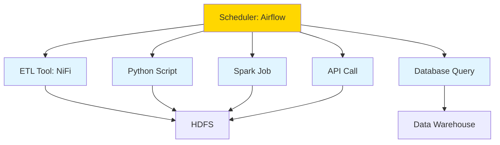
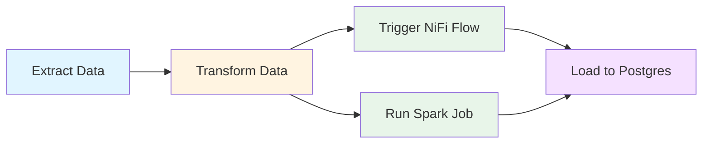

# TP1-ter - Orchestration with Apache Airflow

## Objectives

- Understand the role of orchestration tools in data engineering
- Learn when to use Airflow vs NiFi vs Python scripts
- See how Airflow can coordinate complex data workflows

**Duration:** 30-45 minutes (reading + exploration)
**Difficulty:** Conceptual overview
**Prerequisites:** Completed [TP1-bis - NiFi vs Python](tp1-nifi-or-python.md)

---

## What is Airflow?

**Apache Airflow** is a **workflow orchestration platform** that allows you to:

- 🕒 **Schedule pipelines** (daily, hourly, on-demand)
- 🔗 **Define dependencies** between tasks
- 📦 **Coordinate multiple tools** (Python, Spark, NiFi, databases, APIs)
- 🧠 **Manage complex workflows** using code (Python)
- 📊 **Monitor execution** via a web UI
- 🔄 **Retry failed tasks** automatically
- 📧 **Send alerts** when tasks succeed or fail

### Airflow in the Data Stack



**Airflow orchestrates everything.** It doesn't process data itself—it tells other tools when and how to run.

---

## When to Use Airflow

### ✅ Use Airflow When You Need:

1. **Scheduling and Automation**
   - Run pipelines daily at 2 AM
   - Trigger workflows when new data arrives
   - Execute tasks on a cron schedule

2. **Complex Dependencies**
   - Task B depends on Tasks A1, A2, A3 all completing
   - Parallel execution of independent tasks
   - Conditional logic (run Task X only if Task Y succeeded)

3. **Multi-Tool Integration**
   - Coordinate Python scripts, Spark jobs, NiFi flows, database queries
   - Call external APIs and wait for results
   - Move data between systems (S3 → HDFS → Postgres)

4. **Full Control via Code**
   - Define workflows as Python code (DAGs)
   - Version control your pipelines
   - Programmatic testing and validation

### Example Use Cases:

- **Daily ETL pipeline**: Ingest data from API → Clean with Python → Store in HDFS → Analyze with Spark → Load to Postgres
- **ML model training**: Extract features → Train model → Evaluate → Deploy if accuracy > 95%
- **Report generation**: Fetch data from multiple databases → Aggregate → Generate PDF → Email to stakeholders

---

## Airflow vs NiFi vs Python

### 🔥 When NiFi is Better

**Use NiFi if you need:**

| Feature | Why NiFi Excels |
|---------|----------------|
| ⚡ **Real-time ingestion** | Processes data as it arrives (event-driven) |
| 📂 **File-based pipelines** | Built-in processors for file monitoring |
| 🧩 **Plug-and-play transformations** | 300+ processors out of the box |
| 👀 **Visual flow monitoring** | See data moving through the pipeline in real-time |
| 🔌 **Protocol handling** | Native support for HTTP, FTP, Kafka, MQTT, etc. |

**Example**: Continuously monitor a directory for new CSV files, parse them, and stream to HDFS in real-time.

---

### 🐍 When Python is Better

**Use Python scripts if you need:**

| Feature | Why Python Excels |
|---------|-------------------|
| 🧠 **Low-level control** | Write custom transformation logic |
| 📊 **Data science integration** | Use pandas, scikit-learn, TensorFlow |
| 🔬 **Prototyping** | Quick experiments and one-off analyses |
| 🎯 **Complex algorithms** | Custom business logic that doesn't fit into NiFi processors |

**Example**: Train a machine learning model on employee data, then use it to predict attrition risk.

---

### 🕒 When Airflow is Better

**Use Airflow if you need:**

| Feature | Why Airflow Excels |
|---------|-------------------|
| 📅 **Scheduling** | Run pipelines on a schedule (hourly, daily, monthly) |
| 🔗 **Orchestration** | Coordinate Python scripts, NiFi flows, Spark jobs, databases |
| 🌳 **Complex dependencies** | Task graphs with branching, joining, conditionals |
| 🔄 **Retry logic** | Automatic retries with exponential backoff |
| 📧 **Alerting** | Email/Slack notifications on failure or SLA miss |
| 📦 **Integration ecosystem** | 100+ operators for AWS, GCP, Azure, Databricks, etc. |

**Example**: Every day at 3 AM, run 5 independent Python scripts in parallel, then trigger a Spark job when all finish, then update a dashboard.

---

## How Airflow Works

### DAGs (Directed Acyclic Graphs)

In Airflow, you define workflows as **DAGs** using Python code.

**Example DAG:**

```python
from airflow import DAG
from airflow.operators.bash import BashOperator
from airflow.operators.python import PythonOperator
from datetime import datetime, timedelta

# Define default arguments
default_args = {
    'owner': 'data-team',
    'retries': 2,
    'retry_delay': timedelta(minutes=5),
    'email_on_failure': True,
    'email': ['alerts@company.com']
}

# Define the DAG
with DAG(
    dag_id='employee_etl_pipeline',
    default_args=default_args,
    description='Daily employee data integration',
    schedule_interval='0 2 * * *',  # Every day at 2 AM
    start_date=datetime(2026, 3, 1),
    catchup=False
) as dag:

    # Task 1: Extract data from API
    extract_task = BashOperator(
        task_id='extract_employee_data',
        bash_command='python /opt/scripts/extract_employees.py'
    )

    # Task 2: Run Python ETL script
    transform_task = PythonOperator(
        task_id='transform_data',
        python_callable=run_etl_script  # Your Python function
    )

    # Task 3: Trigger NiFi flow
    trigger_nifi_task = BashOperator(
        task_id='trigger_nifi_flow',
        bash_command='curl -X POST http://nifi:8080/nifi-api/processors/...'
    )

    # Task 4: Run Spark job
    spark_task = BashOperator(
        task_id='run_spark_aggregation',
        bash_command='spark-submit /opt/spark/jobs/aggregate_employees.py'
    )

    # Task 5: Load to database
    load_task = BashOperator(
        task_id='load_to_postgres',
        bash_command='psql -U user -d db -f /opt/sql/load_employees.sql'
    )

    # Define dependencies
    extract_task >> transform_task >> [trigger_nifi_task, spark_task] >> load_task
```

**Dependency Graph Visualization:**



**What this DAG does:**
1. Extracts employee data from an API
2. Transforms it using your Python script
3. **In parallel**, triggers a NiFi flow AND runs a Spark aggregation job
4. Once both complete, loads results to Postgres

---

## Airflow vs NiFi: Key Differences

| Aspect | Airflow | NiFi |
|--------|---------|------|
| **Purpose** | Orchestrate workflows | Process data flows |
| **Processing Model** | Batch (scheduled tasks) | Stream (real-time) + Batch |
| **Definition** | Code (Python DAGs) | Configuration (UI) |
| **Dependencies** | Task-level (A → B → C) | Data-level (file routing) |
| **Monitoring** | Task success/failure | Data provenance |
| **Best For** | Complex multi-step workflows | Continuous data ingestion |

---

## Airflow vs Python Scripts: Key Differences

| Aspect | Airflow | Raw Python Script |
|--------|---------|------------------|
| **Scheduling** | Built-in cron-like scheduler | Needs external cron or manual execution |
| **Retry Logic** | Automatic retries with backoff | Manual try/except |
| **Dependency Management** | Task dependencies in DAG | Sequential execution only |
| **Monitoring** | Web UI with logs, metrics | Manual logging |
| **Alerting** | Built-in email/Slack | Must implement yourself |
| **Parallelization** | Parallel task execution | Manual threading/multiprocessing |

**Think of it this way:**
- **Python script** = A single tool
- **Airflow** = A toolbox that organizes when and how to use all your tools

---

## Real-World Example: E-commerce Data Pipeline

Imagine you run an e-commerce site and need to:

1. **Daily at 1 AM**: Extract sales data from Postgres
2. **Clean the data** using a Python script
3. **Stream clickstream data** from Kafka to HDFS using NiFi (continuous)
4. **Daily at 3 AM**: Run a Spark job to join sales + clickstream data
5. **Generate reports** and load to a data warehouse
6. **Send email** to executives with summary statistics

**How you'd use each tool:**

```
┌─────────────────────────────────────────────────────────────┐
│                    AIRFLOW (Orchestrator)                    │
│  - Schedules all tasks                                       │
│  - Manages dependencies                                      │
│  - Sends alerts on failures                                  │
└──────────────┬──────────────┬──────────────┬────────────────┘
               │              │              │
        ┌──────▼──────┐  ┌───▼──────┐  ┌───▼────────┐
        │   Python    │  │   NiFi   │  │   Spark    │
        │   Script    │  │   Flow   │  │    Job     │
        │  (Extract)  │  │ (Stream) │  │  (Analyze) │
        └─────────────┘  └──────────┘  └────────────┘
```

- **Python**: Extracts and cleans sales data (batch)
- **NiFi**: Continuously streams clickstream data from Kafka to HDFS
- **Spark**: Joins and aggregates data for analysis
- **Airflow**: Orchestrates Python → Spark → Email, monitors NiFi health

---

## Code → ETL → Tools → Orchestration

**The hierarchy of data engineering:**

```
Low-Level                                        High-Level
    │                                                  │
    ▼                                                  ▼
┌────────┐    ┌────────┐    ┌────────┐    ┌──────────────┐
│ Python │ => │  NiFi  │ => │ Spark  │ => │   Airflow    │
│ Script │    │  Flow  │    │  Job   │    │ Orchestrator │
└────────┘    └────────┘    └────────┘    └──────────────┘
  Manual      Configured    Distributed      Scheduled
  Control     Pipeline      Processing       Workflows
```

1. **Python**: Write custom logic
2. **NiFi**: Build reusable data flows
3. **Spark**: Process data at scale
4. **Airflow**: Orchestrate everything

**You don't choose one—you use them together.**

---

## Getting Started with Airflow

### Quick Exploration

Your Hadoop stack includes Airflow! Try it:

```bash
# Start Airflow services
docker-compose --profile airflow up -d

# Access the UI
# Navigate to: http://localhost:8080
# Username: admin
# Password: admin
```

**In the Airflow UI:**
- Browse example DAGs
- Trigger a test DAG manually
- View task logs
- See the dependency graph

### Example: Schedule Your Python ETL

Here's how you'd run your employee ETL script from [TP1-bis](tp1-nifi-or-python.md) daily with Airflow:

```python
from airflow import DAG
from airflow.operators.bash import BashOperator
from datetime import datetime

with DAG(
    dag_id='employee_etl',
    schedule_interval='0 2 * * *',  # Every day at 2 AM
    start_date=datetime(2026, 3, 1),
    catchup=False
) as dag:

    run_etl = BashOperator(
        task_id='run_employee_etl',
        bash_command='cd /opt/hadoop-stack && python practice/data-integration/employee_etl.py',
        retries=3
    )
```

Save this as `dags/employee_etl_dag.py` in your Airflow directory, and it will appear in the UI automatically.

---

## Resources

### Official Documentation
- [Apache Airflow Documentation](https://airflow.apache.org/docs/)
- [Airflow Best Practices](https://airflow.apache.org/docs/apache-airflow/stable/best-practices.html)
- [Airflow Concepts: DAGs](https://airflow.apache.org/docs/apache-airflow/stable/concepts/dags.html)

### Tutorials
- [Airflow Fundamentals (Astronomer)](https://www.astronomer.io/docs/learn/airflow-101)
- [Building Your First DAG](https://airflow.apache.org/docs/apache-airflow/stable/tutorial.html)
- [Airflow for Beginners (freeCodeCamp)](https://www.freecodecamp.org/news/airflow-tutorial-for-beginners/)

### Video Courses
- [Apache Airflow Complete Course (YouTube)](https://www.youtube.com/watch?v=K9AnJ9_ZAXE)
- [Data Engineering with Airflow (Udemy)](https://www.udemy.com/course/data-engineering-with-apache-airflow/)

### Books
- *Data Pipelines with Apache Airflow* by Bas Harenslak and Julian de Ruiter
- *Building Data Pipelines with Airflow* (O'Reilly)

---

## Key Takeaways

✅ **Airflow orchestrates workflows**, it doesn't process data itself
✅ **Use Airflow for scheduling and dependencies** between tasks
✅ **Use NiFi for real-time data ingestion** and monitoring
✅ **Use Python for custom logic** and data science work
✅ **Real data teams use all three** together for different purposes
✅ **Define workflows as code (DAGs)** for version control and testing

---

## What's Next?

Now that you understand the data engineering stack:

1. **Practice NiFi** for building production ETL pipelines → [TP2 - NiFi Use Case](tp1-nifi-use-case.md)
2. **Practice Python** for custom transformations → [TP1-bis - NiFi vs Python](tp1-nifi-or-python.md)
3. **Practice Spark** for large-scale data processing → [Spark Practice](../spark/)
4. **Practice Airflow** by creating your first DAG with the employee ETL pipeline

**Combine them all** to build a complete, scalable data platform! 🚀
