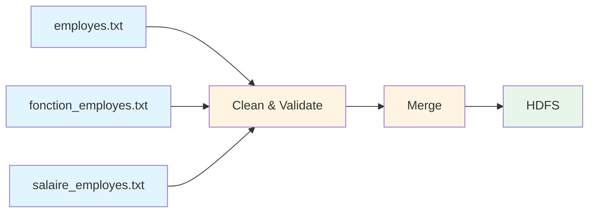
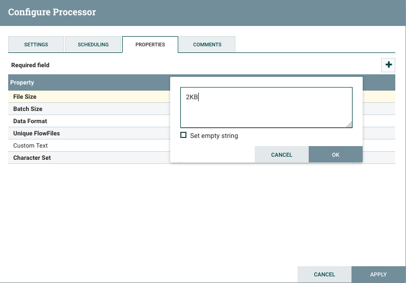
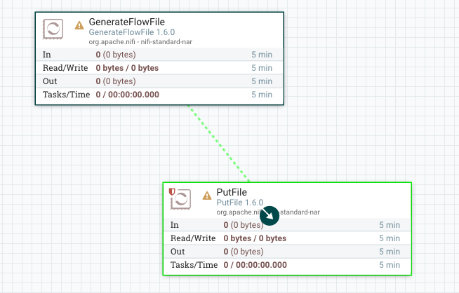

# TP2 - NiFi Real-World Use Case: Employee Data Integration

## Objectives

- Apply NiFi knowledge to integrate real employee data from multiple sources
- Clean and validate data quality issues
- Merge related datasets based on common keys
- Store the final integrated dataset in HDFS
- Understand a complete ETL (Extract, Transform, Load) workflow

**Duration:** 1-2 hours
**Difficulty:** Intermediate

## Business Context

You work for a company that manages employee information across three separate text files:

1. **employes.txt**: Personal information (ID, name, birthdate)
2. **fonction_employes.txt**: Job information (ID, hire year, job title)
3. **salaire_employes.txt**: Salary information (ID, gender, sector, salary, postal code)

Your task is to integrate these three datasets into a single, clean dataset stored in HDFS for further analysis.

## Data Quality Issues

The data has some quality issues you'll need to address:

- **Inconsistent date formats**: Some birthdates in `employes.txt` need to be standardized to `Y-m-d` format (e.g., `2001-01-01`)
- **Different separators**: Files use different delimiters (`;` vs `,`)
- **Character encoding**: Some files contain special characters (é, à, etc.)

## Prerequisites

1. Completed [TP1 - NiFi Introduction](tp1-nifi-intro.md)
2. NiFi running with the Hadoop stack
3. Access to the data files in `data/donnees/`

## Architecture Overview



## Step 1 - Prepare Your Environment

### Start the Services

```bash
# Start NiFi and HDFS
docker-compose --profile nifi up -d

# Verify services are running
docker-compose ps nifi namenode
```

Both containers should show status "Up".

### Prepare the Storage

We need to prepare a folder where NiFi will store the integrated employee data. We will use HDFS as our storage system.

**About HDFS**: HDFS (Hadoop Distributed File System) is designed for **big data** - it stores files across multiple servers for reliability and can handle petabytes of data. In production, this is where you store integrated data for analytics (Hive, Spark, etc.).

**Create the output directory inside the HDFS system**:

These commands run **inside the namenode container** to create a folder in the HDFS file system (not the regular Linux filesystem):

```bash
# Create directory inside HDFS
docker exec -it namenode bash -c "hdfs dfs -mkdir -p /user/nifi/employees"

# Give NiFi permission to write to this directory
docker exec -it namenode bash -c "hdfs dfs -chmod 777 /user/nifi/employees"

# Verify the directory exists in HDFS
docker exec -it namenode bash -c "hdfs dfs -ls /user/nifi/"
```

**What's happening here?**
- `docker exec -it namenode` runs commands inside the namenode container (the HDFS master)
- `hdfs dfs -mkdir` creates a directory in HDFS (not in the regular Linux filesystem)
- `chmod 777` gives full permissions because NiFi runs as a different user
- ⚠️ Note: In production, use `750` instead of `777` for security

Expected output:
```
drwxrwxrwx   - root supergroup          0 2026-03-17 00:00 /user/nifi/employees
```

### Access NiFi UI

Navigate to `https://localhost:8443/nifi` and log in:
- **Username**: `admin`
- **Password**: `adminadminadmin`

## Step 2 - Understand the Source Data

Before building the flow, let's examine our data files.

### employes.txt

```
1;RAU;PAULETTE SARA ADELE;03/03/1989
2;ABGRALL;LUCIEN JACQUES;15/02/1982
3;CHEVET;ANDREE MARIE;26/04/1968
...
```

**Format**: ID;LAST_NAME;FIRST_NAME;BIRTHDATE
**Delimiter**: semicolon (`;`)
**Date Format**: DD/MM/YYYY (needs cleaning to YYYY-MM-DD)

### fonction_employes.txt

```
id_empl;année-embauche;Fonction
1;2015;aide-soignant
2;2006;informaticien
...
```

**Format**: ID;HIRE_YEAR;JOB_TITLE
**Delimiter**: semicolon (`;`)
**Has Header**: Yes (first line)

### salaire_employes.txt

```
Sexe;Secteur;Salaire;Code_postal;id_empl
F;sante;20000euro/an;59000;1
M;sante;35000euro/an;80000;2
...
```

**Format**: GENDER;SECTOR;SALARY;POSTAL_CODE;ID
**Delimiter**: semicolon (`;`)
**Has Header**: Yes (first line)

## Step 3 - Task Assignment: Data Preparation

### YOUR TASK 1: Fix Date Formats

Before starting the NiFi flow, manually edit `data/donnees/employes.txt`:

1. Open the file in a text editor
2. Find **one or two** employee records
3. Change their birthdates from `DD/MM/YYYY` to `YYYY-MM-DD` format

**Example**:
```
# Before
5;VANDENDRIESSCHE;HENRI PIERRE;01/01/2001

# After
5;VANDENDRIESSCHE;HENRI PIERRE;2001-01-01
```

This simulates the kind of data inconsistency you'll encounter in real-world scenarios.

**💡 Tip**: Choose records you can easily identify later for testing (e.g., IDs 5 and 10).

## Step 4 - Build the NiFi Flow

Now we'll create a data flow to process all three files.

### Create a Process Group

To keep things organized:

1. Drag a **Process Group** icon onto the canvas
2. Name it: `Employee Data Integration`
3. Double-click to enter the group

### Flow Architecture

We'll build three parallel ingestion flows that converge into a merge operation:

```
[ListFile] ──→ [FetchFile] ──→ [SplitText] ──→ [LogAttribute] ──→ [ValidateDates] ──┐
                                                                                      │
[ListFile] ──→ [FetchFile] ──→ [SplitText] ──→ [LogAttribute] ────────────────────┤──→ [MergeContent] ──→ [PutHDFS]
                                                                                      │
[ListFile] ──→ [FetchFile] ──→ [SplitText] ──→ [LogAttribute] ────────────────────┘
```

**Key Components**:
- **ListFile**: Lists files in the directory (uses internal state tracking)
- **FetchFile**: Fetches actual file content based on ListFile metadata
- **SplitText**: Splits file into individual lines
- **LogAttribute**: (Optional) Logs each split record for debugging

## Step 5 - Ingest Employee Data (employes.txt)

### Copy Data Files (Important!)

Before starting, ensure the files are accessible to NiFi:

```bash
# Copy files from donnees to csv directory
cp data/donnees/employes.txt data/csv/
cp data/donnees/fonction_employes.txt data/csv/
cp data/donnees/salaire_employes.txt data/csv/
```

### Add ListFile Processor

**Why ListFile instead of GetFile?**
- GetFile requires write permissions to track processed files in the source directory
- ListFile stores tracking state internally in NiFi's state directory
- This works better with read-only mounted volumes

1. **Add Processor**: Search for `ListFile`
2. **Configure**:

**Settings Tab**:
- Name: `List Employee Files`

**Scheduling Tab**:
- Run Schedule: `60 sec`

**Properties Tab**:
- **Input Directory**: `/opt/nifi/csv`
- **File Filter**: `employes.txt`
- **Recurse Subdirectories**: `false`
- **Listing Strategy**: `Timestamps` (tracks files using internal NiFi state)
- **Minimum File Age**: `0 sec`

**Relationships Tab**:
- Auto-terminate: `failure`

3. Click **Apply**

**💡 Testing Tip**: To re-process the same file during testing:
- Stop the ListFile processor
- Right-click → **View State** → **Clear State**
- Start the processor again

### Add FetchFile Processor

This processor fetches the actual file content based on metadata from ListFile.

1. **Add Processor**: Search for `FetchFile`
2. **Configure**:

**Settings Tab**:
- Name: `Fetch Employee Data`

**Properties Tab**:
- **File to Fetch**: `${absolute.path}/${filename}`
  - These attributes are automatically set by ListFile
- **Completion Strategy**: `None` (don't delete or move the source file)

**Relationships Tab**:
- Auto-terminate: `failure`, `not.found`

3. **Connect**: ListFile (success) → FetchFile

### Add SplitText Processor

This processor splits the file into individual records (one FlowFile per line).

1. **Add Processor**: Search for `SplitText`
2. **Configure**:

**Settings Tab**:
- Name: `Split Employee Records`

**Properties Tab**:
- **Line Split Count**: `1` (one line per FlowFile)
- **Header Line Count**: `0` (no header in employes.txt)
- **Remove Trailing Newlines**: `true`

**Relationships Tab**:
- Auto-terminate: `failure`, `original`

3. **Connect**: FetchFile (success) → SplitText

### Add LogAttribute Processor (Optional - for Debugging)

To see the split records in the logs:

1. **Add Processor**: Search for `LogAttribute`
2. **Configure**:

**Settings Tab**:
- Name: `Log Split Records`

**Properties Tab**:
- **Log Level**: `info`
- **Log Payload**: `true` (shows the actual content)
- **Attributes to Log**: (leave empty to log all attributes)
- **Attributes to Ignore**: (leave empty)

**Relationships Tab**:
- Auto-terminate: `success` (after logging, terminate the FlowFile)

3. **Connect**: SplitText (splits) → LogAttribute

**💡 Viewing Logs**: To see the logged content:
```bash
# Follow NiFi logs in real-time
docker logs -f nifi | grep "LogAttribute"
```

Or view logs in NiFi UI: Right-click LogAttribute → **View Status History**

**Note**: For production flows, remove LogAttribute or disable it to avoid log bloat. It's useful for debugging only.

### Add ExtractText for Extracting Employee Data

We'll use regex to extract the employee ID and full record from each line.

1. **Add Processor**: Search for `ExtractText`
2. **Configure**:

**Settings Tab**:
- Name: `Extract Employee Data`

**Properties Tab**:
Click **"+"** to add custom properties:
- **employee_id**: `^([^;]+)`
  - Regex to extract the first field (ID) before the first semicolon
- **full_line**: `^(.+)$`
  - Regex to capture the entire line

**Additional Properties** (defaults to keep):
- **Character Set**: `UTF-8`
- **Maximum Buffer Size**: `1 MB`
- **Enable Multiline Mode**: `false`
- **Enable Unix Lines Mode**: `false`
- **Enable Repeating Capture Group**: `false`
- **Include Capture Group 0**: `true`
- **Enable named group support**: `false`

**Settings Tab - Auto-terminate Relationships**:
- Check: `failure`

3. **Connect**: SplitText (splits) → ExtractText

### Add RouteOnContent (Optional - for Advanced Users)

To route records based on date format:

1. **Add Processor**: Search for `RouteOnContent`
2. **Properties**:
   - **Match Requirement**: `content must contain match`
   - Add property **old_format**: `.*\d{2}/\d{2}/\d{4}.*` (matches DD/MM/YYYY)
   - Add property **new_format**: `.*\d{4}-\d{2}-\d{2}.*` (matches YYYY-MM-DD)

This allows you to handle old and new formats differently (e.g., log warnings or apply transformations).

For simplicity, we'll skip this in the basic flow.

### Add AttributesToJSON Processor

Convert our record to JSON format for easier merging:

1. **Add Processor**: Search for `AttributesToJSON`
2. **Configure**:

**Properties Tab**:
- **Attributes List**: `employee_id,full_line`
- **Destination**: `flowfile-content` (replace content with JSON)
- **Include Core Attributes**: `false`

**Settings Tab - Auto-terminate Relationships**:
- Check: `failure`

3. **Connect**: ExtractText (matched) → AttributesToJSON

## Step 6 - Ingest Function Data (fonction_employes.txt)

Repeat the process for job functions data:

### Add ListFile Processor #2

1. **Add Processor**: `ListFile`
2. **Configure**:

**Settings Tab**:
- Name: `List Function Files`

**Properties Tab**:
- **Input Directory**: `/opt/nifi/csv`
- **File Filter**: `fonction_employes.txt`
- **Listing Strategy**: `Timestamps`

**Relationships Tab**:
- Auto-terminate: `failure`

### Add FetchFile Processor #2

1. **Add Processor**: `FetchFile`
2. **Configure**:

**Settings Tab**:
- Name: `Fetch Function Data`

**Properties Tab**:
- **File to Fetch**: `${absolute.path}/${filename}`
- **Completion Strategy**: `None`

**Relationships Tab**:
- Auto-terminate: `failure`, `not.found`

3. **Connect**: ListFile (success) → FetchFile

### Add SplitText Processor #2

1. **Add Processor**: `SplitText`
2. **Configure**:

**Properties**:
- **Line Split Count**: `1`
- **Header Line Count**: `1` (⚠️ This file HAS a header!)
- **Remove Trailing Newlines**: `true`

**Relationships Tab**:
- Auto-terminate: `failure`, `original`

3. **Connect**: FetchFile (success) → SplitText

### Add LogAttribute Processor #2 (Optional)

1. **Add Processor**: `LogAttribute`
2. **Configure**:
   - Name: `Log Function Records`
   - **Log Level**: `info`
   - **Log Payload**: `true`
   - Auto-terminate: `success`
3. **Connect**: SplitText (splits) → LogAttribute

### Add ConvertRecord Processor

For this file, let's use a more advanced processor to parse CSV data:

1. **Add Processor**: Search for `ConvertRecord`
2. Before configuring, we need Controller Services...

#### Configure Controller Services

Controller Services are shared configurations used by multiple processors.

1. Click the **hamburger menu** (☰) in the top-right
2. Select **Controller Settings**
3. Go to **Controller Services** tab
4. Click **"+"** to add a new service

**Add CSVReader**:
1. Search for `CSVReader`
2. Add **CSVReader**
3. Click the **⚙️** icon to configure:
   - **Schema Access Strategy**: `Infer Schema`
   - **Delimiter**: `;` (semicolon)
   - **Treat First Line as Header**: `true`
4. Click **Apply**
5. Click the **⚡** (lightning bolt) icon to **Enable** the service

**Add JSONRecordSetWriter**:
1. Click **"+"** again
2. Search for `JsonRecordSetWriter`
3. Add **JsonRecordSetWriter**
4. Configure:
   - **Schema Access Strategy**: `Inherit Record Schema`
   - **Pretty Print JSON**: `true` (optional, for readability)
5. Click **Apply**
6. **Enable** the service

Now return to your flow canvas.

#### Configure ConvertRecord

**Properties**:
- **Record Reader**: `CSVReader` (select the service you just created)
- **Record Writer**: `JsonRecordSetWriter`

**Auto-terminate**: `failure`

3. **Connect**: SplitText (splits) → ConvertRecord

This will convert CSV records to JSON format.

## Step 7 - Ingest Salary Data (salaire_employes.txt)

Repeat the same process for salary data:

1. **ListFile** → Name: `List Salary Files`, File Filter: `salaire_employes.txt`
2. **FetchFile** → Name: `Fetch Salary Data`
3. **SplitText** → Header Line Count: `1`
4. **LogAttribute** (Optional) → Name: `Log Salary Records`
5. **ConvertRecord** → Use the same CSVReader and JSONRecordSetWriter services

Connect: ListFile → FetchFile → SplitText → LogAttribute → ConvertRecord

## Step 8 - Merge All Data Streams

Now we have three streams of JSON records. Let's merge them.

### Option A: Simple Approach - Merge All Content

For a simple concatenation of all records:

1. **Add Processor**: Search for `MergeContent`
2. **Configure**:

**Settings Tab**:
- Name: `Merge All Employee Data`

**Properties Tab**:
- **Merge Strategy**: `Bin-Packing Algorithm`
- **Merge Format**: `Binary Concatenation`
- **Delimiter Strategy**: `Text`
- **Demarcator**: `\n` (newline between records)
- **Minimum Number of Entries**: `3` (wait for at least 3 FlowFiles)
- **Maximum Number of Entries**: `1000`
- **Max Bin Age**: `1 min`

**Auto-terminate**: `failure`, `original`

3. **Connect all three JSON outputs** to this MergeContent processor

### Option B: Advanced Approach - Proper Join (Bonus)

For a proper join on `employee_id` / `id_empl`, you would need to:

1. Use **ExecuteScript** processor with Groovy/Python
2. Or use **QueryRecord** processor with SQL-like syntax
3. Join the three streams: `SELECT * FROM employees JOIN functions ON employees.id = functions.id_empl JOIN salaries ON employees.id = salaries.id_empl`

This is more complex and recommended only after mastering the basics.

## Step 9 - Store Data in HDFS

### Configure HDFS Connection

First, create a Hadoop Configuration Resources file that NiFi can use.

#### Option 1: Mount Configuration Files (Recommended)

The easiest way is to use the existing Hadoop config:

```bash
# The hadoop_config folder is already available in your project
# We'll reference it from NiFi
```

You'll need to update the docker-compose.yml to mount the config into NiFi:

```yaml
nifi:
  volumes:
    - ./hadoop_config:/opt/nifi/hadoop_config:ro
```

Then restart NiFi:
```bash
docker-compose --profile nifi down
docker-compose --profile nifi up -d
```

#### Option 2: Manual Configuration

1. Create a file `hadoop_config/core-site.xml` if not exists
2. Ensure it contains the NameNode address:
```xml
<configuration>
  <property>
    <name>fs.defaultFS</name>
    <value>hdfs://namenode:8020</value>
  </property>
</configuration>
```

### Add PutHDFS Processor

Now add the processor to write data to HDFS:

1. **Add Processor**: Search for `PutHDFS`
2. **Configure**:

**Settings Tab**:
- Name: `Store in HDFS`

**Properties Tab**:
- **Hadoop Configuration Resources**: `/opt/nifi/hadoop_config/core-site.xml`
  - If you didn't mount the config, leave this blank and set the next property
- **Additional Classpath Resources**: (leave empty)
- **Directory**: `/user/nifi/employees`
- **Conflict Resolution Strategy**: `replace` (overwrite existing files)
- **Compression codec**: `NONE` (or choose `GZIP` for compression)

**Auto-terminate**: `failure`, `success`

⚠️ **Important**: PutHDFS requires access to Hadoop libraries. If you encounter errors, you may need to:
- Use **PutFile** processor to write locally first, then manually copy to HDFS
- Or configure the Hadoop client libraries in NiFi



3. **Connect**: MergeContent (merged) → PutHDFS

### Alternative: PutFile + Manual HDFS Copy

If PutHDFS doesn't work (common issue with containerized environments):

1. Use **PutFile** processor instead:
   - **Directory**: `/opt/nifi/output`
   - Create the output directory: `mkdir -p data/output` on host
   - Mount it in docker-compose: `- ./data/output:/opt/nifi/output`

2. Manually copy to HDFS:
   ```bash
   # Copy file from NiFi output to HDFS
   docker cp nifi:/opt/nifi/output/merged_employees.txt ./merged_employees.txt
   docker cp ./merged_employees.txt namenode:/tmp/
   docker exec -it namenode hdfs dfs -put /tmp/merged_employees.txt /user/nifi/employees/
   ```

## Step 10 - Run and Test the Flow

### Start the Flow

1. **Select all processors** in the process group
2. **Right-click** → **Start**
3. **Monitor the flow**:
   - Watch FlowFiles move through connections
   - Check for errors (red indicators)
   - View statistics on each processor



### Verify the Output

Check that data was written to HDFS:

```bash
# List files in HDFS
docker exec -it namenode hdfs dfs -ls /user/nifi/employees/

# View the content
docker exec -it namenode hdfs dfs -cat /user/nifi/employees/* | head -20
```

You should see merged employee data with records from all three source files.

### Check Data Quality

Verify that your manually corrected dates are present:

```bash
# Search for your corrected employee ID (e.g., ID 5)
docker exec -it namenode hdfs dfs -cat /user/nifi/employees/* | grep "\"5\""
```

Look for the date in YYYY-MM-DD format.

## Step 11 - Monitor and Debug

### View Data Provenance

1. **Right-click** any processor
2. Select **View data provenance**
3. Click on a FlowFile event
4. Explore:
   - **Attributes** tab: See all metadata
   - **Content** tab: View the actual data
   - **Lineage** tab: Trace the FlowFile's journey

### Check for Errors

1. View the **Bulletin Board** (top-right corner)
2. Look for ERROR or WARNING messages
3. Right-click a processor → **View Status History** for performance metrics

### Common Issues

**Issue**: "No FlowFiles entering ListFile/FetchFile"
- **Solution 1**: Verify files exist in `/opt/nifi/csv` inside the container: `docker exec -it nifi ls /opt/nifi/csv`
- **Solution 2**: ListFile has already processed the file. Clear state: Stop processor → Right-click → View State → Clear State → Start

**Issue**: "Directory does not have sufficient permissions" (if using GetFile)
- **Solution**: Use ListFile + FetchFile instead (as shown in this guide)

**Issue**: "Cannot write to HDFS - Connection refused"
- **Solution**:
  - Check HDFS is running: `docker-compose ps namenode`
  - Verify network connectivity: `docker exec -it nifi ping namenode`
  - Use PutFile as alternative (see Step 9)

**Issue**: "MergeContent never produces output"
- **Solution**: Lower **Minimum Number of Entries** to `1` for testing, or ensure all three source processors are running

## Step 12 - Bonus Challenge: Postgres Integration

For advanced learners, try this bonus task:

### Task: Import Data from Postgres

The stack includes a Postgres database (`postgres-source`). Try to:

1. **Load sample data** into Postgres:
   ```bash
   docker exec -it postgres-source psql -U sourceuser -d sourcedb -c "
   CREATE TABLE employees_bonus (
     id INT PRIMARY KEY,
     bonus_amount DECIMAL(10,2),
     bonus_year INT
   );

   INSERT INTO employees_bonus VALUES
   (1, 2500.00, 2023),
   (2, 3000.00, 2023),
   (3, 1500.00, 2023);
   "
   ```

2. **Add to your NiFi flow**:
   - Use **ExecuteSQL** or **QueryDatabaseTable** processor
   - Configure a DBCPConnectionPool controller service:
     - Database Connection URL: `jdbc:postgresql://postgres-source:5432/sourcedb`
     - Database Driver: `org.postgresql.Driver`
     - Username: `sourceuser`
     - Password: `sourcepw`
   - Join the bonus data with your employee data
   - Store the enriched dataset in HDFS

**Hints**:
- You may need to add the Postgres JDBC driver to NiFi (already included in the metastore, but NiFi needs it separately)
- Use **ConvertRecord** to transform database results to JSON
- Use **JoinEnrichment** or **ExecuteScript** to merge with existing employee data

## Key Takeaways

✅ Real-world data integration involves multiple source files with different formats
✅ Data quality issues (date formats, encoding) must be addressed during ingestion
✅ NiFi's visual interface makes complex ETL workflows easier to build and maintain
✅ Controller Services enable reusable configurations across processors
✅ HDFS provides scalable storage for integrated datasets
✅ Data provenance in NiFi allows complete traceability of data transformations

## Cleanup

When finished:

1. **Stop the flow**: Select all → Stop
2. **Optional**: Export your flow as a template
   - Right-click process group → **Download flow definition**
   - Save the JSON file for future use
3. **Stop containers** (if done):
   ```bash
   docker-compose --profile nifi down
   ```

## Additional Challenges

Want to practice more? Try these:

1. **Add Data Validation**:
   - Use **ValidateRecord** to check for missing values
   - Route invalid records to a separate HDFS directory

2. **Add Enrichment**:
   - Use **LookupRecord** to add department names based on job titles
   - Create a reference table in HDFS or Postgres

3. **Schedule the Flow**:
   - Configure processors to run on a schedule (e.g., daily at 2 AM)
   - Use **ExecuteProcess** to trigger file availability checks

4. **Add Notifications**:
   - Use **PutEmail** to send alerts when processing completes
   - Use **InvokeHTTP** to call a webhook with statistics

## Resources

- [Apache NiFi Processor Documentation](https://nifi.apache.org/docs/nifi-docs/components/org.apache.nifi/)
- [NiFi Expression Language Guide](https://nifi.apache.org/docs/nifi-docs/html/expression-language-guide.html)
- [NiFi Record Path Guide](https://nifi.apache.org/docs/nifi-docs/html/record-path-guide.html)
- [HDFS Commands Reference](https://hadoop.apache.org/docs/stable/hadoop-project-dist/hadoop-common/FileSystemShell.html)

## Next Steps

Congratulations! You've completed a real-world data integration scenario with NiFi.

You now have the skills to:
- Build ETL pipelines for multi-source data integration
- Handle data quality issues
- Store processed data in distributed systems like HDFS
- Monitor and debug data flows

Consider exploring:
- [Apache Airflow Practice](../airflow/) for workflow orchestration
- [Spark Practice](../spark/) for large-scale data processing
- [Hive Practice](../hive/) for SQL-based analytics on HDFS data
